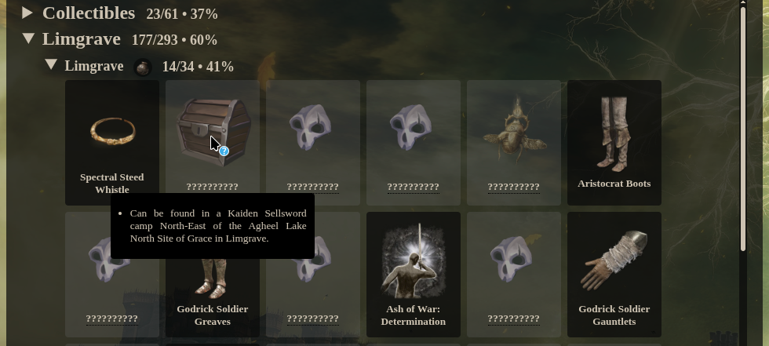

# Elden Ring Progression Tracker v2

This tool lets users upload their Elden Ring savefile and then parses available characters and their
inventory. That result is checked against a list of available items to calculate the percentage of
items the selected character has already collected.

> [!WARNING]
>
> Due to the way the Elden Ring savefile is constructed the tool is unable to recognize missing
> items that have been found once but discarded. If, for example, a character has picked up a Dagger
> but has since removed it from their inventory and storage chest, the tool will still consider the
> Dagger item to be present in the character's inventory. Unfortunately fixing this is out of scope.

The results are summarized by regions who are subdivided into their respective zone. For example,
the section *Limgrave* has sub-sections for its zones (e.g. *Church of Elleh*, *Stormhill*, etc.).

## Items

The tool takes into account the following item types:

- Weapons
- Armor (chest/head/arms/legs)
- Talismans (except "Sacrificial Twig")
- Sorceries
- Incantations
- Spirit Ashes
- Ashes of War
- Unique Tools (e.g. Prattling Prate, Cookbooks, etc.)

The tool also counts all non-respawning collectibles in a special summary section. These are:

- Memory Stone
- Talisman Pouch
- Cracked Pot
- Ritual Pot
- Perfume Bottles

> [!WARNING]
>
>  The tool has trouble with the following items:
>
> - [Beast Champion Armor]
> - [Errant Sorcerer Robe]
> - [War Surgeon Gown]
>
> These armor pieces are obtained in their altered state and cannot be correctly identified as their
> unaltered piece even if it is in the players inventory. This can be fixed by dropping the version
> of the armor the tool reports missing and then picking it up.
>
> Otherwise the tool doesn't differentiate between altered and unaltered armor.

## Progress Tracking Calculation

There are three types of completion percentage.

1. Global Completion (percentage of items found in the entire game)
2. Region Completion (percentage of items found in a region, e.g. Limgrave)
3. Zone Completion (percentage of items found in a single zone, e.g. Castle Mourne)

> [!WARNING]
>
> Some items that have to be farmed by killing enemies can be found in multiple regions. That means
> they are duplicated in the list of all available items, meaning the completion percentages can be
> off if a lot of farmable items are missing.

Items obtained through NPC quests are listed in a separate section with sub-sections for each NPC.

## Missing Items
By default, items that are missing from the character's inventory have their name and image hidden.
When hovering over the missing item card a message stating how the item can be obtained is shown.

The image used for the card represents how the item can be obtained. It can be of these categories:

- `Boss | Foe | NPC Invader | Chest | Merchant | Quest | Teardrop Scarab`

There is an option to show the details for missing items. When activated the name for missing items
is displayed and clicking the link will take you to the item page in the [Elden Ring Wiki].
  
## Special Thanks

- [Zidodelakarai] Author of the original tool from whom I forked this repository
- [Uinelj] Contributor to the original tool at the time of forking
- [BenoitAnastay] Contributor to the original tool at the time of forking
- [CyberGiant7] Author of [Elden Ring Automatic Checklist] who built the savefile reading functions
- Contributors of the [Master Spreadsheet] for figuring out the item IDs
- Reddit User [Erigondo] for providing all the [items pictures]
- All Contributors to the [Elden Ring Wiki]

###
<!-- Credits -->
[Zidodelakarai]: https://github.com/Zidodelakarai
[Uinelj]: https://github.com/Uinelj
[BenoitAnastay]: https://github.com/BenoitAnastay
[CyberGiant7]: https://github.com/CyberGiant7
[Elden Ring Automatic Checklist]: https://github.com/CyberGiant7/Elden-Ring-Automatic-Checklist
[Master Spreadsheet]: https://docs.google.com/spreadsheets/d/1c7rIV3bBKDxP9ngixgigd7ZmczH3DYhDmMt8HY4ijV0/edit#gid=242218508
[Erigondo]: https://www.reddit.com/user/Erigondo/
[items pictures]: https://www.reddit.com/r/fromsoftware/comments/tqoav1/all_game_item_images_sfx_spell_textures_elden_ring/

<!-- Wiki Links -->
[Elden Ring Wiki]: https://eldenring.wiki.fextralife.com/Elden+Ring+Wiki
[Beast Champion Armor]: https://eldenring.wiki.fextralife.com/Beast_Champion_Armor
[Errant Sorcerer Robe]: https://eldenring.wiki.fextralife.com/Errant_Sorcerer_Robe
[War Surgeon Gown]: https://eldenring.wiki.fextralife.com/War_Surgeon_Gown